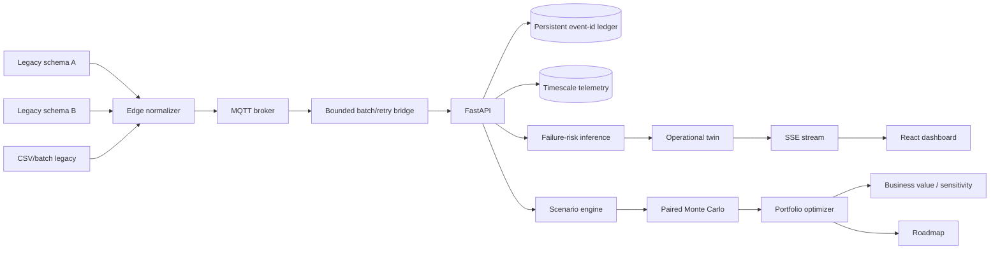

# Target-state architecture

```mermaid
flowchart LR
  LA[Legacy schema A] --> N[Edge normalizer]
  LB[Legacy schema B] --> N
  LC[CSV/batch legacy] --> N
  N --> MQ[MQTT broker]
  MQ --> BR[Bounded batch/retry bridge]
  BR --> API[FastAPI]
  API --> ID[(Persistent event-id ledger)]
  API --> TS[(Timescale telemetry)]
  API --> ML[Failure-risk inference]
  ML --> DT[Operational twin]
  DT --> SSE[SSE stream]
  SSE --> UI[React dashboard]
  API --> SE[Scenario engine]
  SE --> MC[Paired Monte Carlo]
  MC --> OP[Portfolio optimizer]
  OP --> BV[Business value / sensitivity]
  OP --> RM[Roadmap]
```

The target remains intentionally student-scale: MQTT, FastAPI, PostgreSQL/Timescale, simulation and ML are enough. No Kafka/Kubernetes/cloud/LLM layer is added.
